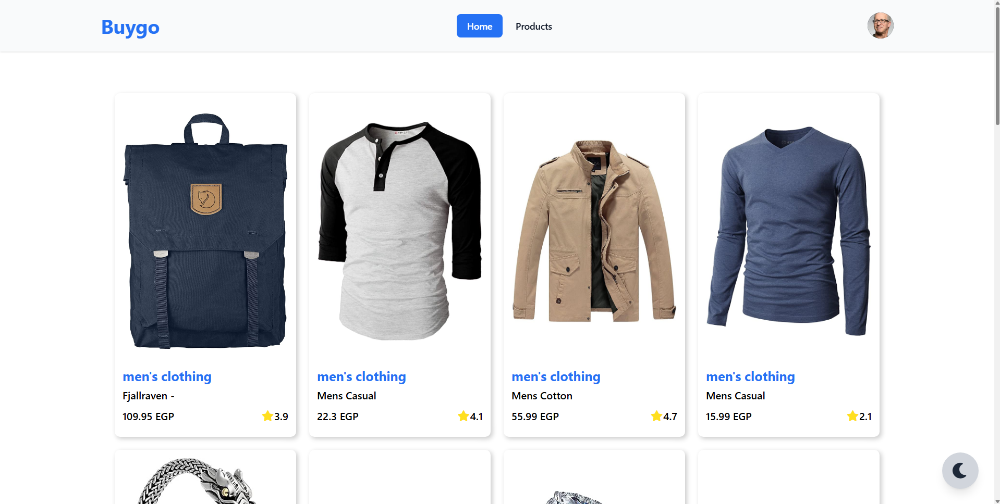
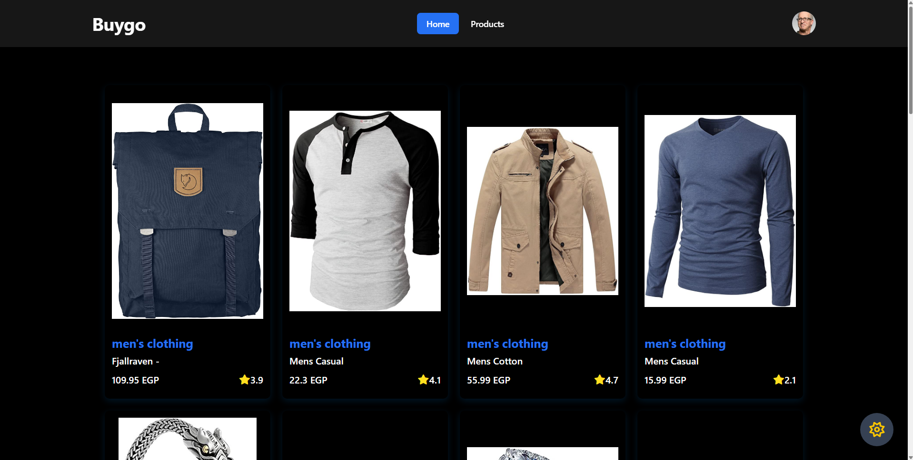
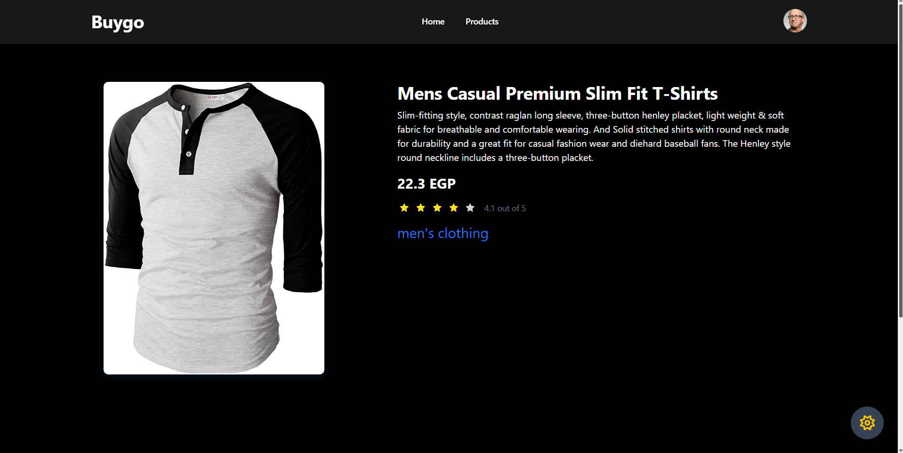
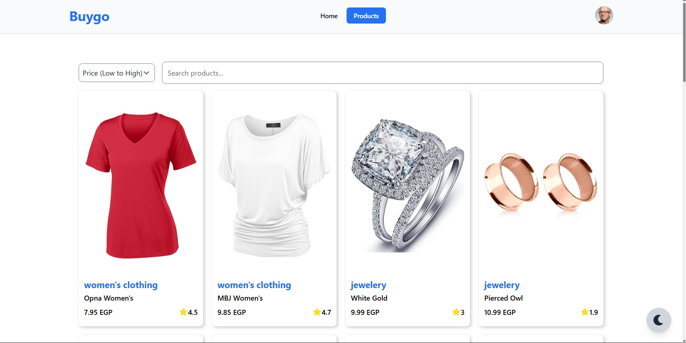

## 🚀 Project Overview

**Route Task** is a modern and responsive web application showcasing UI design, routing, API integration, and animations using React and Vite. The project demonstrates clean, modular frontend practices with Tailwind CSS and essential UI libraries.

It was created as part of a frontend development task to highlight practical skills in building interactive, scalable interfaces and deploying to GitHub Pages.

---

## 🖼️ Screenshots

> UI previews of the project:






---

## 🛠 Tech Stack Used

### 🧩 Core Technologies:
- **React 19** – Functional components and modern hooks
- **Vite** – Fast and lightweight development/build tool
- **Tailwind CSS 4** – Utility-first CSS framework
- **React Router DOM 7** – Navigation and routing
- **Axios** – API calls
- **Framer Motion** – Smooth UI animations
- **React Query** – Efficient server state management
- **Flowbite** – Pre-built Tailwind components

### 🧰 Dev Tools:
- **gh-pages** – GitHub Pages deployment
- **ESLint** – Code style and linting
- **@vitejs/plugin-react** – React support in Vite

---

## 🌍 Deployment

The app is live at:  
👉 [https://omarmansour22.github.io/Route-Task/](https://omarmansour22.github.io/Route-Task/)

### To deploy manually:

```bash
npm run build
npm run deploy
